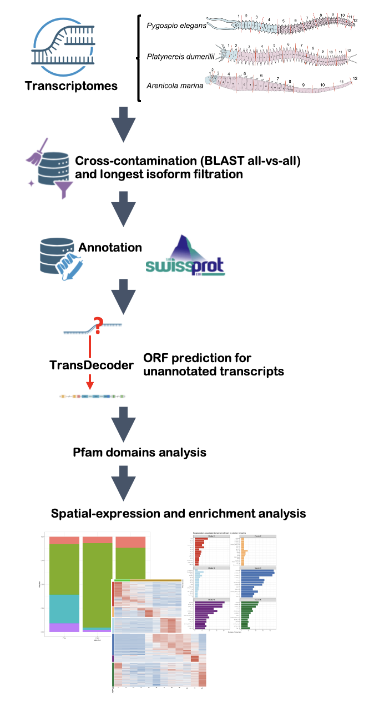

# Analysis of the distribution and identification of unannotated transcripts in intact annelids *Pygospio elegans (Spionidae)*, *Platynereis dumerilii (Nereididae)*, and *Arenicola marina (Arenicolidae)*

## Project goals

The main goal of this project was to identify and characterize potentially novel proteins involved in annelid regeneration using transcriptomic datasets from:

- *Arenicola marina*
- *Platynereis dumerilii*
- *Perinereis elegans*

Main tasks:

- transcriptome decontamination;

- ORF prediction;

- annotation using SwissProt;

- extraction of unknown proteins;

- Pfam domain prediction;

- expression patterns analysis;

- spatial expression analysis using TPM heatmaps.

## Pipeline overview

<p align="center">
  
</p>


### Step 1. Transcriptomes preparation

Transcript identifiers were prefixed with species labels in order to distinguish sequences during downstream all-vs-all similarity searches.


**Input:** Raw transcriptomes from three annelid species were used:

- *Arenicola marina*
- *Platynereis dumerilii*
- *Pygospio elegans*

```bash
sed 's/^>/>Amar_/' Amar_AP_transcripts.fasta > amar_prefixed.fasta
```

Then three FASTA files were merged in one FASTA-file.

```bash
cat amar_prefixed.fasta pdum_prefixed.fasta pele_prefixed.fasta > all_samples.fasta
```

**Output:** combined transcriptome FASTA for three species `all_samples.fasta`


### Step 2. Cross-contamination filtering


The goal of this step was to identify highly similar interspecies transcript sequences potentially representing cross-contamination.
All-vs-all BLASTn search was performed using the combined transcriptome assembly.

**Input:** `all_samples.fasta` from the previous step

At first we make BLAST-base from the merged FASTA-file:

```bash
makeblastdb -in all_samples.fasta -dbtype nucl -out all_samples_db
```

Then perform all-vs-all BLAST

```bash
blastn \
-query all_samples.fasta \
-db all_samples_db \
-out all_vs_all.tsv \
-outfmt "6 qseqid sseqid pident length qlen slen evalue bitscore" \
-perc_identity 95
```

Parameters:
- perc_identity = 95 was used to detect highly similar transcript pairs;
- only interspecies matches were retained;
- transcript pairs with identity ≥98% and alignment coverage ≥80% were considered potential contamination.

Potential contaminants were additionally filtered using transcript expression levels (TPM). 
For each transcript pair, the log2(TPM ratio) was calculated using maximal TPM values across body segments.

A threshold of |log2_ratio| ≥ 1.25 was selected based on the bimodal distribution of TPM ratios.
[вставить картинку распределения]


**Output:**

- cleaned transcriptome assembly `transcripts_clean.fasta`

- list of removed contaminant contigs `transcripts_to_remove.txt`


### Step 3. Longest isoform selection

To reduce transcript redundancy, only the longest isoform for each gene was retained.

**Input:** `transcripts_clean.fasta`, Trinity gene-transcript mapping information 

Transcript lengths were calculated using seqkit:

```bash
seqkit fx2tab -n -l transcripts_clean.fasta > transcript_lengths.tsv
```

Transcript lengths were then combined with Trinity gene-transcript mapping information `all_gene_trans_map.txt`: 

```bash
awk 'NR==FNR{len[$1]=$2; next} {print $2"\t"$1"\t"len[$1]}' \
transcript_lengths.tsv \
all_gene_trans_map.txt \
> gene_transcript_length.tsv
```

For each gene, the longest transcript isoform was selected:

```bash
sort -k1,1 -k3,3nr gene_transcript_length.tsv | \
awk '!seen[$1]++ {print $2}' \
> longest_isoforms_ids.txt
```

The selected transcript IDs were extracted into a separate FASTA file:

```bash
seqkit grep -f longest_isoforms_ids.txt transcripts_clean.fasta > longest_isoforms.fasta
```

**Output:** nonredundant transcriptome assembly (`longest_isoforms.fasta`)

### Step 4. ORF prediction

Protein-coding regions were predicted using TransDecoder.

**Input:** `longest_isoforms.fasta`

```bash
TransDecoder.LongOrfs -t longest_isoforms.fasta
TransDecoder.Predict -t longest_isoforms.fasta
```

**Output:** `longest_isoforms.fasta.transdecoder.pep`

### Step 5. Annotation and unknown transcripts selection

**Input:** `longest_isoforms.fasta.transdecoder.pep`, SwissProt database 


Make diamond database from downloaded uniprot_sprot.fasta.gz and use `uniprot_sprot.dmnd`:

```bash
diamond makedb --in uniprot_sprot.fasta -d uniprot_sprot.dmnd
```


Only complete ORFs were retained for downstream analysis in order to reduce fragmented and low-confidence predictions.

```bash
seqkit grep -f complete_ids.txt longest_isoforms.fasta.transdecoder.pep > proteins_complete_only.pep
```

Predicted proteins were annotated against the SwissProt database using DIAMOND blastp.

```bash
diamond blastp \
-q proteins_complete_only.pep \
-d uniprot_sprot.dmnd \
-o blastp_results.tsv \
-e 1e-5 \
-k 1
```

Only the best hit (-k 1) was retained for each query protein.
An e-value threshold of 1e-5 was used to reduce low-confidence matches.

Proteins with predicted ORFs but without significant SwissProt matches were classified as candidate unknown proteins.

```bash
grep "^>" longest_isoforms.fasta.transdecoder.pep | cut -d' ' -f1 | sed 's/\.p[0-9]*$//' | sort | uniq > pep_ids_clean.txt
```


Also proteins shorter than 100 amino acids were excluded from downstream analyses.

```bash
seqkit seq -m 100 unknown_proteins.pep -o unknown_proteins_100aa.pep 
```

**Output:** `unknown_proteins_100aa.pep` - unknown proteins with complete ORF containig >100 amino acids

### Step 6. Pfam annotation

Pfam domains were predicted using hmmscan from the HMMER package.

**Input:** `unknown_proteins_100aa.pep`

```bash
hmmscan \
--cpu 16 \
--domtblout pfam_hits.tsv \
Pfam-A.hmm \
unknown_proteins_100aa.pep
```

Only domain hits with i-Evalue < 1e-10 were retained.

**Output:**  `pfam_hits.tsv`

### Step 7. Spatial expression analysis

TPM expression matrices were merged with Pfam domain annotations and separated by species. 
Expression values were normalized using row-wise z-score transformation. 
Transcripts were clustered according to their anterior–posterior expression profiles using k-means clustering, 
and heatmaps were generated to visualize spatial expression patterns across body segments. 
Pfam domains enriched within individual clusters were additionally summarized and visualized using enrichment barplots.

### Step 8. Enrichment analysis

Comparative heatmaps were generated for conserved Pfam domains shared between all three species. 
Separate analyses were performed for DUF (Domains of Unknown Function) proteins and regeneration-associated domains. 
Candidate regeneration-related transcripts were selected based on Pfam annotations linked to:

- signaling pathways, 

- transcription factors, 

- chromatin remodeling, 

- developmental regulation.


## Software used - пофиксить версии

| Tool | Version | Purpose |
|---|---|---|
| BLAST+ | 2.15 | all-vs-all similarity search |
| seqkit | 2.8 | FASTA processing |
| TransDecoder | 5.7 | ORF prediction |
| DIAMOND | 2.1 | protein annotation |
| HMMER | 3.4 | Pfam domain search |
| CD-HIT | 4.8 | redundancy reduction |
| R | 4.4 | statistics and visualization |


## System requirements

Recommended:

- Linux / macOS
- ≥16 CPU threads
- ≥64 GB RAM
- ≥500 GB free disk space

The all-vs-all BLAST step is the most computationally intensive.

## Results

## Conclusions

## References


Platova, S.E., Poliushkevich, L.O., Starunova, Z.I. et al. Transcriptomic analysis of three annelid species: looking for markers of positional information. BMC Genomics 27, 392 (2026). https://doi.org/10.1186/s12864-026-12671-5


